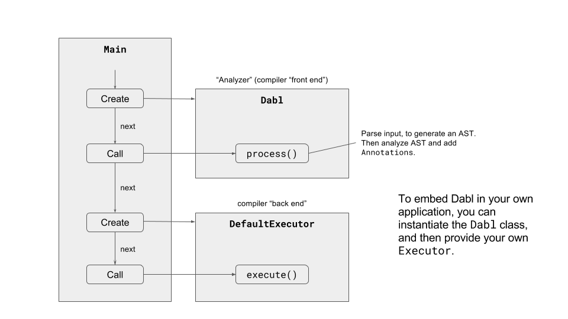
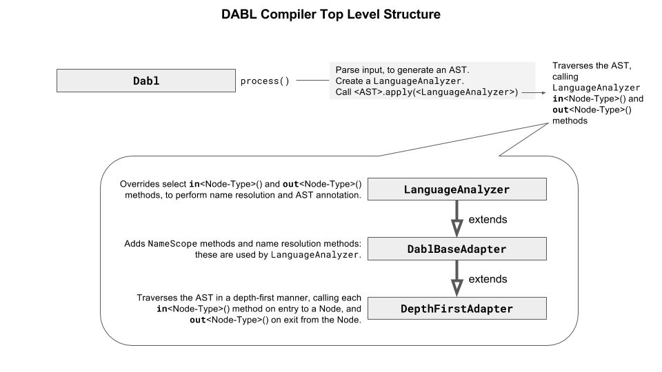
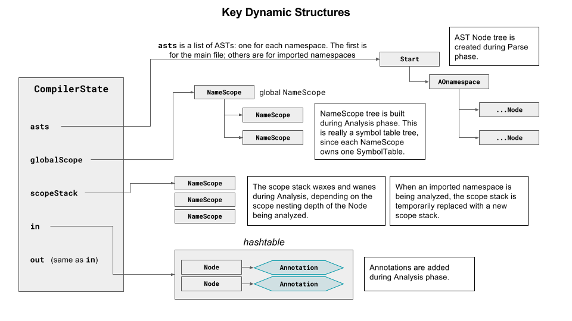
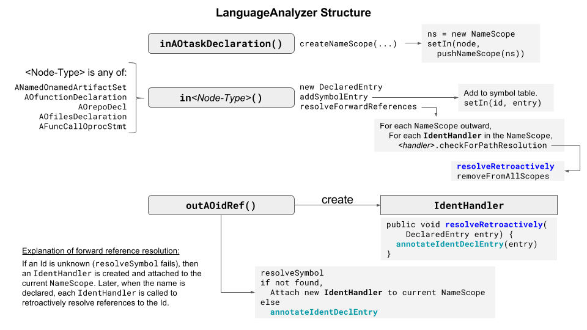
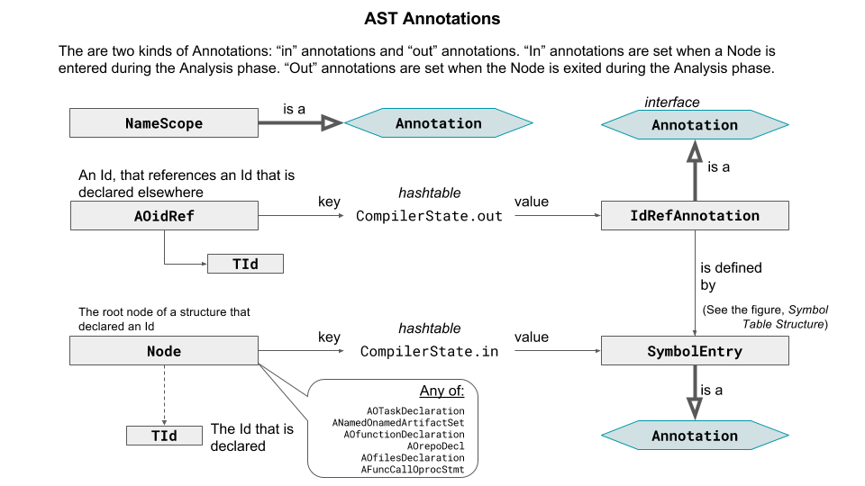
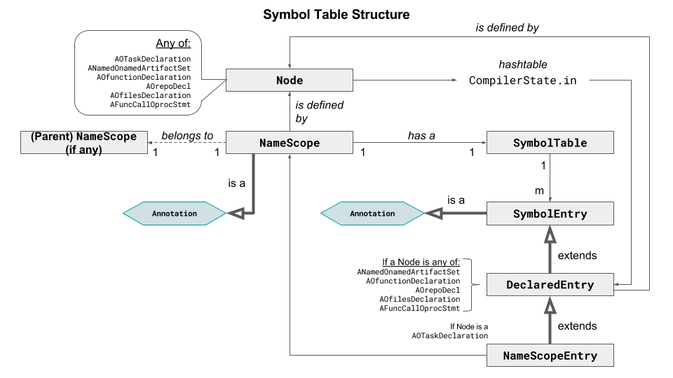
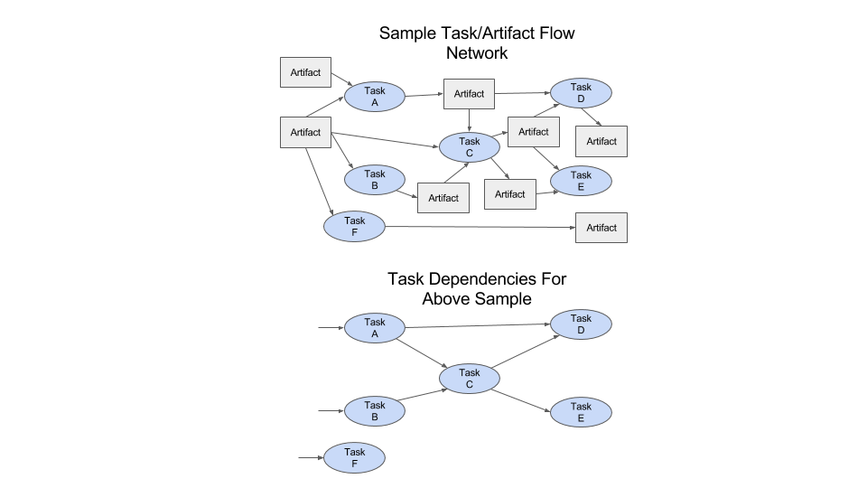
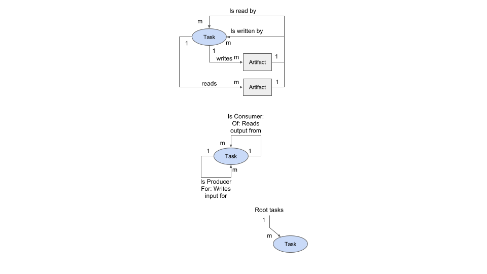
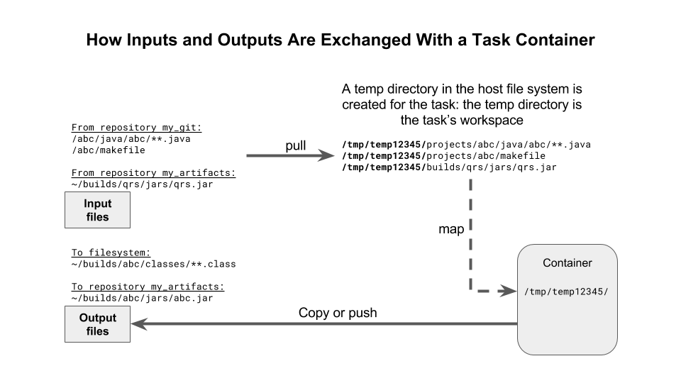

# Compiler Design

## Main Program Top Level Structure

The DABL compiler consists of two main parts: an Analyzer and an Executor. 

The
Analyzer parses the input, builds an abstract syntax tree (AST) according to the
AST model defined in the language grammar spec, 
[`dabl.sablecc`](https://github.com/Scaled-Markets/dabl/blob/master/dabl.sablecc),
and then annotates the AST in order
to perform name resolution and link things up as well as check against language
semantic rules. The Executor acts on the resulting annotated and validated AST.

If embedding the compiler, one can
provide one's own Executor. The default Executor that is provided,
`DefaultExecutor`, implements the actions defined by DABL: that is, it performs
dependency analysis on the tasks based on their `when` expressions and inputs and
outputs, and then executes the tasks in the proper sequence by creating a docker
container for each task.

The Analyzer is embodied by the Dabl module. It invokes the
<code>scaledmarkets.dabl.parser.Parser</code> class, which parses input and builds the
AST.

The <code>scaledmarkets.dabl.parser.Parser</code> class is
generated by the [SableCC parser generator](http://www.sablecc.org/),
based on the `dabl.sablecc` grammar.

The `LanguageAnalyzer` extends a base class that builds an Abstract Syntax Tree (AST),
as defined by the `dabl.sablecc` grammar spec. This AST construction constitutes the
Parse phase.

## Template Processing Phase

TBD

## Parse Phase

TBD

## Analysis Phase

### Key Dynamic Structures

The compiler's dynamic structure is completely encapsulated in the
[`CompilerState`](analyzer/CompilerState.java) object.
The argument-less `process()` method creates a `CompilerState` instance and provides
it when constructing a `LanguageAnalyzer`.

The dynamic structures are shown in the following Figure. The `CompilerState`
object is returned by the compiler.

### Language Analyzer

The [`LanguageAnalyzer`](analysis/LanguageAnalyzer.java) class performs the Analysis processing phase
(see https://github.com/Scaled-Markets/dabl/tree/master/langref#processing-phases).

The Analysis phase walks the tree in a depth-first manner, visiting each `Node`,
calling the `in`*Node-Type*(`Node`) method on entry to each Node, and the
`out`*Node-Type*(`Node`) method on exit from the `Node`. The `LanguageAnalyzer`
class provides these methods, as overrides of `in`*Node-Type*(`Node`) and
`out`*Node-Type*(`Node`) methods from the base class. These methods
perform actions such as name resolution and evaluate some static
expressions. The outcome of the Analysis phase
is a hashtable of `Annotations`, indexed by `Node`: thus, Analysis effectively annotates
the AST, since for any `Node`, one can look up its `Annotation` (if any).

The Analysis phase also produces a symbol table tree, with one table corresponding
to each nested scope within the source input.

### AST Annotations

There are four kinds of annotation:

* `NameScope`.
* `SymbolEntry`.
* `IdRefAnnotation`.
* `ExprAnnotation`.

Each implements the `Annotation` interface.

Note that there are two separate annotation tables: `in` and `out`. `in` annotations
are added by `in`*Node-Type*() methods, and `out` annotations are added
by `out`*Node-Type*() methods.

The structure of annotations is shown in the figure.

### Symbol Table Structure

A `NameScope` is an annotation that specifies that the associated `Node` is a
declarative region (within which symbols can be defined). `NameScopes` form a
hierarchy. Each `NameScope` owns one `SymbolTable`, which contains the symbols
that are declared by that declarative region. This is depicted in the figure.

### Analyzer Output

The Analyzer returns a [`CompilerState`](analysis/CompilerState.java) object. In the
`CompilerState`, the `globalScope` variable references the root level
[`NameScope`](analysis/NameScope.java) object.
A `NameScope` references a [`SymbolTable`](analysis/SymbolTable.java) consisting of
[`SymbolEntries`](analysis/SymbolEntry.java).
`SymbolEntries` that are [`NameScopeEntries`](analysis/NameScopeEntry.java) own their
own `NameScopes`,
which in turn reference their own `SymbolTables`, creating a hierarchy
of `NameScopes`.

The `CompilerState` also references an abstract syntax tree (AST),
whose structure is defined by the Abstract Syntax Tree section of the
[dabl.sablecc](https://github.com/Scaled-Markets/dabl/blob/master/dabl.sablecc)
file,
and which can be accessed via the methods in the generated `scaledmarkets.dabl.node` package.
The AST node Java classes are generated by the build process; their Javadocs
can be found in package `scaledmarkets.dabl.node` of the
[generated javadocs](https://scaledmarkets.github.io/dabl/).

The linkage between the AST and the `NameScope` hierarchy is as follows:
`SymbolEntries` that are [`DeclaredEntries`](analysis/DeclaredEntry.java)
provide a `getDefiningNode()` method, which provides a reference to
the AST `Node` that declares the symbol that the `SymbolEntry` defines.

## Execution Phase

### Default Executor

TBD

### Dependency Graph

The [`DefaultExecutor`](exec/DefaultExecutor.java) creates a dependency graph,
by calling 
[`DependencyGraph`](exec/DependencyGraph.java)'s `genDependencySet` method.
The dependency graph is a non-persistent structure that is created
in order to decide which tasks to execute in response to an external event.
Once the dependency graph has been created, the `DefaultExecutor` executes it by
calling the `executeAll` method, supplying the dependency graph as a parameter.

The purpose of the dependency graph is to determine the order of task execution:
task A must be executed before task B if task B is “downstream” from A - that is,
if A produces outputs that eventually affect inputs to B. Also, if neither A or B
are downstream from the other, then they exist in distinct dependency graphs.
Distinct graphs can be executed in parallel. Logical dependencies are illustrated
in the figures below.

A dependency graph can be constructed by simply removing the artifacts from the
graph of tasks and their input and output artifacts. The key algorithms are as follows.

<b>genDependencies()</b> 
<ol>
	<li>Create a graph of the artifact/task flow relationships.</li>
	<li>Determine the task dependency graph.</li>
	<li>Identify the root tasks - those not dependent on any other task.</li>
</ol>

<b>executeAll(set S of task dependency graphs)</b> 
For each root task tr,
<ol>
	<li>executeTaskTree(tr)</li>
</ol>

<b>executeTaskTree(Task t)</b> 
If t is not downstream from a task that has not been visited yet,
<ol>
	<li>If t’s ‘when’ condition is true, then execute(t).</li>
	<li>For each task t_o that is immediately downstream of t,
		<ol>
			<li>executeTaskTree(t_o)</li>
		</ol>
		</li>
</ol>

<b>genDependencies()</b> (in detail):
<ol>
	<li>Create a graph of the artifact/task flow relationships: 
		For each task,
		<ol>
			<li>Add a new Task to the set of tasks.</li>
			<li>For each of the task’s inputs,
				<ol>
					<li>If the input Artifact does not exist in the graph, then create a new Artifact.</li>
					<li>Add the task to the input Artifact’s list of “IsReadBy”.</li>
					<li>Add the input Artifact to the task’s list of inputs.</li>
				</ol>
				</li>
			<li>For each of the task’s outputs,
				<ol>
					<li>If the output Artifact does not exist in the graph, then create a new Artifact.</li>
					<li>Add the task to the output Artifact’s list of “IsWrittenBy”.</li>
					<li>Add the output Artifact to the task’s list of outputs.</li>
				</ol>
				</li>
		</ol>
		</li>
	<li>Determine task dependency graph: 
	For each Artifact,
	<ol>
	<li>Add a Producer and Consumer relation between each input task and each output task.</li>
	</ol>
	</li>
	<li>Identify root tasks: 
	For each task,
	<ol>
	<li>If that has no producer, then add it to the set of root tasks.</li>
	</ol>
	</li>
</ol>

The actual dependency graph structures that are created are illustrated below.

### Task Executor

When the DABL `DefaultExecutor` executes a task, it does so by creating a container,
transporting the files required for the task into a location accessible to the
container, and then streaming to the container a “task program”.

A task program adheres to DABL syntax, but only a subset of the DABL language
is allowed. Specifically, the following statement types are rejected by the
`TaskProgramAnalyzer`, which executes in the container:

* `artifact_decl`
* `repo_decl`
* `files_decl`
* `typographic_decl` (ignored)
* `translation_decl` (ignored)

Thus, only these are allowed:

* `import_decl`
* `task_decl`
* `function_decl`

Also, only one `task_decl` is permitted in a task program.

When the `TaskProgramAnalyzer` completes successfully, the `TaskExecutor` (also
in the container) executes the task.

### Docker Daemon Interface

Docker is used to create a distinct and therefore isolated container for each task.
The only inputs from the host system that can reach a task's container are those that are specified
in the task's input set, and similarly the only outputs that can leave the container
and remain on the host system are those specified in the task's output set. This makes is possible to control
the side effects that a task has on the build environment.

Docker runs as a daemon on its host system. The normal configuration is that the
daemon listens on a unix socket, `unix:///var/run/docker.sock`. There are no pure Java
libraries for accessing unix sockets, so native code is necessary. We slightly
adapted the code from the [junixsocket](https://github.com/kohlschutter/junixsocket)
project. (The only modifications were to the static code in the `NativeUnixSocket`
class, to use standard JNI library loading instead of `NarSystem` used by
`junixsocket`, and to replace the use of `maven` with `make`.)
We then create a [`Jersey`](https://jersey.java.net) compatible
socket factory, and use `Jersey` to connect to the docker daemon socket via HTTP/REST.

Note that an alternative would have been to use the Docker Java API library that
has been developed by Docker, but we found that it is - at this time - completely
undocumented, and examination of the test suite left many questions unanswered.
We found it easier to access the Docker REST API directly, which is fully
documented [here](https://docs.docker.com/engine/api/v1.27/). Hopefully future
versions of the Docker REST API will not break our interface - Docker is not known for
maintaining backward compatibility.

The result is a package `scaledmarkets.dabl.docker` which does exactly what we
need for this project.

### How Data Is Exchanged With a Task Container

When the [`DefaultExecutor`](exec/DefaultExecutor.java) prepares to execute a
task, it creates a temporary directory for the task, to serve as the task's
workspace. The `DefaultExecutor` then creates an isolated container for the task,
mapping the workspace directory into the container's file system.
The `DefaultExecutor` then copies the task's inputs to the workspace. When the
task completes, the `DefaultExecutor` copies the task's outputs (and only the
outputs) to the task output locations.

