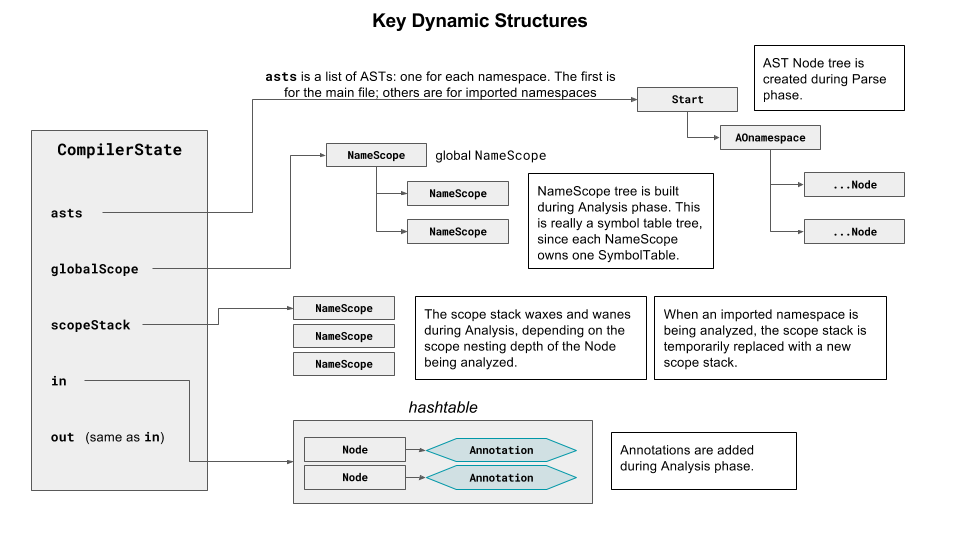
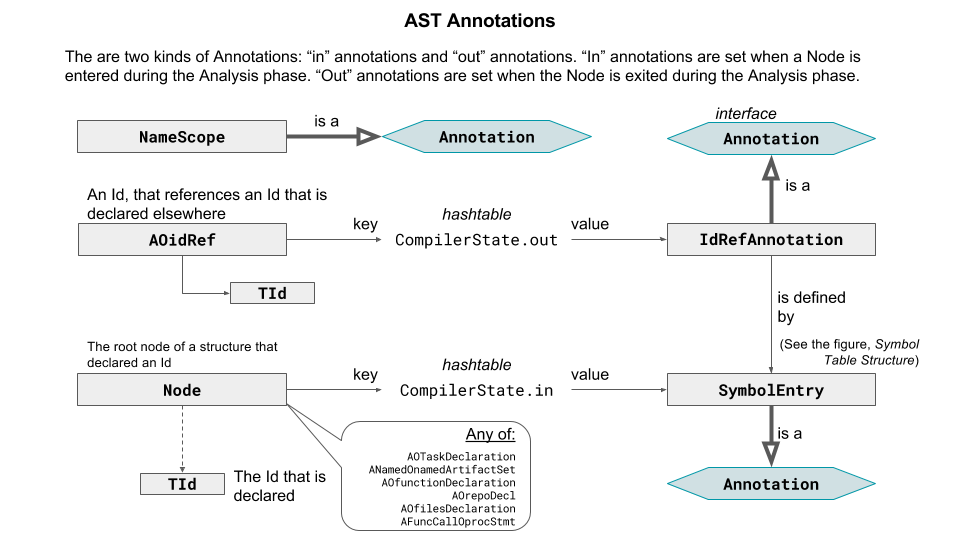
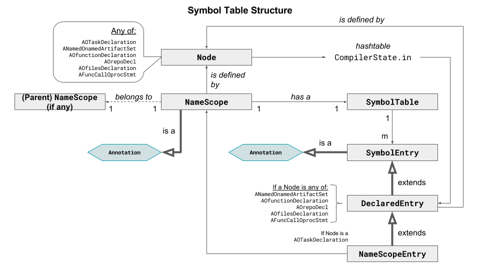

# Compiler Design

## Template Processor

TBD

## Parser

The <code>scaledmarkets.dabl.parser.Parser</code> class parses input and builds an
Abstract Syntax Tree (AST). The language grammar and the AST structure are
both defined in the input grammar file,
[`dabl.sablecc`](https://github.com/Scaled-Markets/dabl/blob/master/dabl.sablecc).
The <code>scaledmarkets.dabl.parser.Parser</code> class is
generated by the [SableCC parser generator](http://www.sablecc.org/),
based on the `dabl.sablecc` grammar file.

## Key Dynamic Structures

The Parse phase builds an Abstract Syntax Tree (AST), as defined by the `dabl.sablecc` file.
The Analysis phase walks the tree in a depth-first manner, visiting each `Node`,
calling the `in`<Node-Type>(`Node`) method on entry to each Node, and the
`out`<Node-Type>(`Node`) method on exit from the `Node`. These methods
perform actions such as name resolution and evaluate some static
expressions. The outcome of the Analysis phase
is a hashtable of `Annotations`, indexed by `Node`: thus, Analysis effectively annotates
the AST, since for any `Node`, one can look up its `Annotation` (if any).

The Analysis phase also produces a symbol table tree, with one table corresponding
to each nested scope within the source input.

The dynamic structures are shown in the following Figure. The `CompilerState`
object is returned by the compiler.

## Language Analyzer

The <code>LanguageAnalyzer</code> class performs the Analysis processing phase
(see https://github.com/Scaled-Markets/dabl/tree/master/langref#processing-phases).

The Language Analyzer annotates the AST, as shown in the figure.

Symbols are organized into symbol tables, as depicted in the figure.

The Language Analyzer uses the following:

<dl>
	<dd><code>Compiler state</code> - </dd>
	<dd><dl>
		<dd><code>ast</code> - </dd>
		<dd><code>globalScope</code> - </dd>
		<dd><code>scopeStack</code> - </dd>
		<dd><code>in</code> - </dd>
		<dd><code>out</code> - </dd>
	</dl></dd>
	
	<dd><code>NameScope</code></dd>
	
	<dd><code>DablBaseAdapter</code> (extends <code>DepthFirstAdapter</code>) - 
		Base class for <code>LanguageAnalyzer</code>. Key methods include:
		<dl>
		<dd><code>addSymbolEntry(SymbolEntry entry, TId id, NameScope enclosingScope)</code> -
			Adds the specified symbol table entry for the specified Id to
			the specified name scope.</dd>
		<dd><code>createNameScope(Node node)</code> - Create a new NameScope within the current
			NameScope, push the new NameScope on the scope stack, and annotate
			the specified Node with the new NameScope.</dd>
		<dd><code>setExprAnnotation(POexpr node, Object value)</code> - Annotate the specified
			POExpr node with a new ExprAnnotation.</dd>
		<dd><code>setExprRefAnnotation(POexpr node, Object value, SymbolEntry entry)</code> - 
			Annotate the specified POexpr node with a new ExprRefAnnotation.</dd>
		</dl>
		
	<dd><code>SymbolTable</code> (a <code>HashMap<String, SymbolEntry>)</code> -
		Self explanatory.</dd>
	
	<dd><code>SymbolEntry</code> (abstract) - All symbol table entries are of a
		derived type.</dd>
	
	<dd><code>DeclaredEntry</code> (extends <code>SymbolEntry</code>) - A symbol
		that is defined in a declaration.</dd>
	
	<dd><code>NameScopeEntry</code> (extends <code>DeclaredEntry</code>) - A
		<code>DeclaredEntry</code> that defines a lexical name scope.</dd>
	
	<dd><code>Annotation</code> (abstract) - Base type for all AST node annotations.</dd>
	
	<dd><code>NameScope</code> (extends <code>Annotation</code>) - All Axxx classes
		that define a lexical scope should be annotated with this. A
		<code>NameScope</code> contains a <code>SymbolTable</code>.</dd>
	
	<dd><code>ExprAnnotation</code> (extends <code>Annotation</code>) - An annotation
		for a expression node.</dd>
	
	<dd><code>ExprRefAnnotation</code> (extends <code>ExprAnnotation</code>) -
		For expressions whose value is defined in the declaration of a symbol.</dd>
	
	<dd><code>IdentHandler</code> - An <code>IdentHandler</code> is attached to
		enclosing scopes when a symbol
		is not recognized but might be defined later in an enclosing scope. Later,
		when the symbol is defined, attached Handlers are checked to see if any
		refer to the symbol. If so, the Handler's <code>resolveRetroactively</code>
		method is called, to resolve the original symbol reference.</dd>

</dl>

## Compiler Output

The compiler returns a [`CompilerState`](CompilerState.java) object. In the
`CompilerState`, the `globalScope` variable references the root level
[`NameScope`](NameScope.java) object.
A `NameScope` references a [`SymbolTable`](SymbolTable.java) consisting of
[`SymbolEntries`](SymbolEntry.java).
`SymbolEntries` that are [`NameScopeEntries`](NameScopeEntry.java) own their
own `NameScopes`,
which in turn reference their own `SymbolTables`, creating a hierarchy
of `NameScopes`.

The `CompilerState` also references an abstract syntax tree (AST),
whose structure is defined by the Abstract Syntax Tree section of the
[dabl.sablecc](https://github.com/Scaled-Markets/dabl/blob/master/dabl.sablecc)
file,
and which can be accessed via the methods in the generated `scaledmarkets.dabl.node` package.
The AST node Java classes are generated by the build process; their Javadocs
can be found in package `scaledmarkets.dabl.node` of the
[generated javadocs](https://scaledmarkets.github.io/dabl/).

The linkage between the AST and the `NameScope` hierarchy is as follows:
`SymbolEntries` that are [`DeclaredEntries`](DeclaredEntry.java)
provide a `getDefiningNode()` method, which provides a reference to
the AST `Node` that declares the symbol that the `SymbolEntry` defines.
